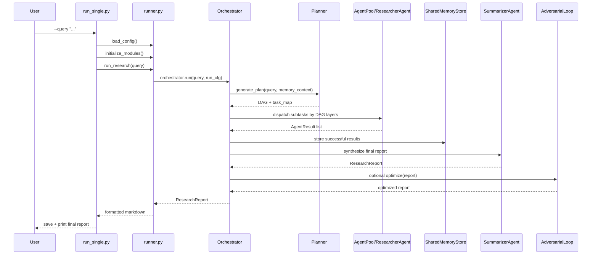

# 单次 Query 的运行流程

本文档说明单次 query 的运行流程，以及主流程在代码中的调用路径。

## 1. 入口有哪几种

这个项目有几条常见入口：

- `scripts/run_single.py`
- `scripts/run_repl.py`
- `scripts/run_eval.py`
- `scripts/run_ablation.py`
- `scripts/run_benchmark.py`
- `scripts/run_all_experiments.py`

单次研究任务的主入口是 `scripts/run_single.py`。

## 2. 单次运行的最短调用链

最核心的调用链可以概括成：

```text
run_single.py
  -> load_config()
  -> initialize_modules()
  -> run_research()
      -> orchestrator.run()
          -> planner.generate_plan()
          -> dispatch agents
          -> collect results
          -> summarize report
          -> optional adversarial loop
      -> _format_report()
  -> save_report()
```

## 3. 从命令行开始

`scripts/run_single.py` 做的事情很直接：

1. 解析命令行参数。
2. 准备日志文件。
3. 调用 `load_config()` 读取 YAML 配置。
4. 调用 `initialize_modules()` 组装全部核心模块。
5. 调用 `run_research()` 执行完整研究流程。
6. 把最终报告保存为 Markdown 文件。

这一层主要负责启动系统和组织运行参数。

## 4. 模块初始化阶段做了什么

`src/core/runner.py` 中的 `initialize_modules()` 是整个系统的装配点。

它按顺序初始化：

1. 模型后端和模块级 policy
2. `Planner`
3. `ContextCompressor`
4. `SharedMemoryStore`
5. 工具列表
6. `RedAgent` / `BlueAgent` / `AdversarialLoop`
7. `AgentPool`
8. `Orchestrator`

模块初始化阶段负责实例化主流程所需的核心组件，并完成后端绑定。

## 5. 运行阶段的核心：`run_research()`

`run_research()` 主要做四件事：

1. 把配置映射成 `RunConfig`
2. 调用 `orchestrator.run(query, config=run_cfg)`
3. 在研究完成后关闭 `WebSearchTool` 的共享 session
4. 把 `ResearchReport` 重新格式化为用户可读的 Markdown

主流程执行逻辑位于 `Orchestrator` 内部。

## 6. Orchestrator 的状态机

`Orchestrator` 内部维护一个显式状态机，大致会经历：

```text
IDLE
-> PLANNING
-> DISPATCHING
-> COLLECTING
-> SYNTHESIZING
-> ADVERSARIAL
-> DONE
```

异常情况下还可能进入：

```text
REPLANNING
FAILED
```

状态机负责控制主流程中的阶段切换。

## 7. 一次 query 的详细时序



## 8. Planning 阶段

在 `PLANNING` 状态里，系统会：

1. 先构造记忆上下文
2. 把 query 和上下文交给 `Planner`
3. 要求 `Planner` 生成 JSON 格式的 `sub_tasks`
4. 再将这些任务转成 DAG

规划阶段要求输出可解析的 JSON 结构和无环依赖图。

如果规划失败，系统通常会直接进入 `FAILED`，因为最初计划如果都无法生成，后续调度就无从谈起。

## 9. Dispatching 阶段

规划完成后，`Orchestrator` 会：

1. 按 DAG 的并行层分组
2. 每层里用 `asyncio.gather()` 并发跑多个子任务
3. 用 `Semaphore` 控制最大并发数
4. 每个子任务再单独加 `timeout`

并发执行以 DAG 层级为单位，同层中不存在依赖冲突的任务可以并发运行。

## 10. 单个子任务如何执行

一个子任务执行时，大概会发生：

1. `Orchestrator` 根据 `task_type` 向 `AgentPool` 申请一个 agent
2. 构造上下文，把依赖任务结果注入进去
3. 调用 `agent.run(subtask, context)`
4. agent 在内部做多轮 tool-calling
5. 返回 `AgentResult`
6. `AgentPool.release_agent()` 回收 agent

`AgentPool` 负责复用 agent 实例，子任务执行逻辑位于 `ResearcherAgent.run()`。

## 11. Collecting 阶段

当一层或全部子任务完成后，系统进入 `COLLECTING`：

1. 把结果写进 orchestrator 自己的运行时内存字典
2. 把成功结果同步写入 `SharedMemoryStore`
3. 统计成功数、失败数、超时数
4. 决定是否需要 `REPLANNING`

触发重规划的主要依据是失败率，例如：

- 失败率大于 50%
- 或成功比例过低且存在失败

## 12. Replanning 阶段

如果子任务执行情况太差，系统不会立即整体失败，而会尝试：

1. 收集失败任务
2. 汇总失败原因
3. 调用 `Planner.replan()`
4. 生成新的 DAG
5. 重新进入 `DISPATCHING`

重规划阶段用于在执行后更新任务图并重新调度。

## 13. Synthesizing 阶段

所有子结果收集后，系统创建一个特殊的“合成任务”，并交给 `SummarizerAgent`。

它会：

1. 按子任务置信度排序结果
2. 构造长上下文 prompt
3. 一次性调用模型生成最终报告
4. 解析出来源列表
5. 计算整体置信度

整体置信度由模型自评和子任务执行成功率共同计算:

```text
整体置信度 = LLM 自评分 × sqrt(子任务成功率)
```

## 14. Adversarial 阶段

如果 `enable_adversarial = true`，系统还不会立刻结束。

它会先检查最终报告的 `confidence`：

- 如果 `confidence >= 0.8`，直接跳过对抗修复
- 否则进入 `AdversarialLoop`

对抗环节在满足条件时执行。

## 15. 最终格式化与保存

`run_research()` 拿到 `ResearchReport` 后会调用 `_format_report()`，把内容整理成：

- 标题
- 报告正文
- 元信息
- 参考来源

最后 `save_report()` 会按时间戳和 query 前缀生成文件名，写入 `outputs/reports`。

## 16. REPL 模式和单次运行的区别

`scripts/run_repl.py` 与 `run_single.py` 的主要区别在于:

- REPL 会复用同一个 `modules`
- 共享同一个 `session_id`
- `SharedMemoryStore` 的 session 数据可以跨多轮问题持续保留

因此 REPL 模式更适合“连续追问”和“带记忆的研究”。

## 17. 故障与降级策略

这个项目不是遇错就整轮崩掉，而是有几层降级思路：

- 单个子任务超时：标记为 `TIMEOUT`，继续走
- 单个子任务失败：标记为 `FAILED`，继续走
- 失败比例过高：尝试重规划
- 全局超时：如果已经有部分结果，尽量强制进入合成
- 合成失败：生成降级版 `ResearchReport`

这类容错逻辑是它比“单次大模型调用”更像系统工程的地方。

## 18. 这一流程最值得记住的实现点

### 不是“先搜完再写”，而是“按 DAG 分层执行后再统一合成”

### 不是“多角色讨论”，而是“编排器驱动多个研究 worker”

### 不是“所有模块总在运行”，而是有条件触发，例如 adversarial

### 最终交付对象是 `ResearchReport`，用户看到的是它格式化后的 Markdown

如果你已经理解了流程，下一步建议读 [03-architecture-and-data-models.md](./03-architecture-and-data-models.md)。
