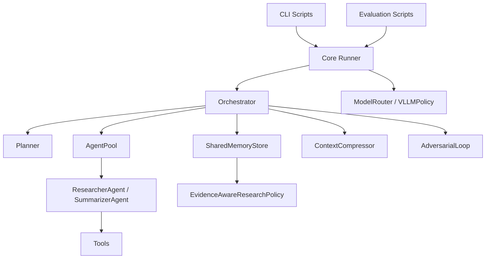

# 架构分层与数据模型

## 1. 总体架构

这个项目可以按职责拆成 7 层：

1. 入口层
2. 运行编排层
3. 任务规划层
4. Agent 执行层
5. 工具层
6. 质量与记忆层
7. 评测与实验层

## 2. 分层示意



## 3. 顶层目录与架构关系

| 目录 | 架构中的角色 |
| --- | --- |
| `scripts/` | 各种运行入口 |
| `src/core/` | 初始化和统一运行壳层 |
| `src/orchestrator/` | 编排器、状态机、对象池、共享 schema |
| `src/planner/` | 任务拆解与 DAG |
| `src/agents/` | Worker 和合成 Agent |
| `src/tools/` | 搜索、网页、论文、计算、文件、笔记等工具 |
| `src/memory/` | 持久化记忆与向量检索 |
| `src/evidence/` | 证据状态建模与 research policy |
| `src/compressor/` | 上下文压缩 |
| `src/adversarial/` | Red/Blue 对抗优化 |
| `src/models/` | 模型后端适配 |
| `evaluation/` | benchmark、指标和报告 |

## 4. 核心数据结构

这些结构定义在 `src/orchestrator/schemas.py`，是全系统共享的公共语言。

### 4.1 `SubTask`

表示一个原子子任务，主要字段有：

- `task_id`
- `task_type`
- `description`
- `dependencies`
- `context_keys`
- `timeout_seconds`
- `expected_type`
- `search_hints`

### 4.2 `AgentResult`

表示一个 agent 执行子任务后的结果，主要字段有：

- `task_id`
- `status`
- `output`
- `trajectory`
- `token_usage`
- `confidence`

### 4.3 `ResearchReport`

表示最终交付的研究报告，主要字段有：

- `query`
- `content`
- `sources`
- `confidence`
- `num_searches`
- `num_replan`
- `adversarial_rounds`
- `final_score`

### 4.4 `RunConfig`

表示一次运行的控制参数，主要字段有：

- `max_concurrent`
- `global_timeout_seconds`
- `max_replan_rounds`
- `max_sub_questions`
- `enable_adversarial`
- `enable_evolution`

### 4.5 `DAG`

表示任务依赖图，负责：

- 添加节点和边
- 拓扑排序
- 生成可并行分层

## 5. 关键对象之间怎么协作

### `runner.py`

负责集中装配：

- 建 policy
- 建工具
- 建 planner
- 建 memory
- 建 adversarial loop
- 建 orchestrator

它是依赖注入层，而不是业务逻辑中心。

### `Orchestrator`

是系统的大脑，负责：

- 维护状态机
- 调 planner
- 调 agent pool
- 收集结果
- 触发合成
- 触发 adversarial

### `AgentPool`

负责生命周期管理：

- 获取 agent
- 复用空闲 agent
- 异常时丢弃污染 agent

### `Planner`

把自然语言 query 变成结构化任务图。

### `ResearcherAgent`

负责绝大多数“搜、读、算、总结”子任务。

### `SummarizerAgent`

负责最终报告写作。

### `EvidenceAwareResearchPolicy`

负责把共享记忆中的证据进一步整理成结构化策略信号，例如：

- `recommended_action`
- `candidate_actions`
- `covered_terms`
- `missing_terms`
- `evidence_strength`
- `uncertainty`

## 6. 一个容易误解的点：任务类型和 Agent 类型不是一一对应

从 schema 看，任务类型有：

- `search`
- `analyze`
- `verify`

很多人会以为这三种任务会被分配给三类不同 Agent。

但当前实现里，`AgentPool._create_agent()` 对这三类任务都返回 `ResearcherAgent`。

所以：

- 任务类型在当前系统里更多是“语义标签”和“调度标签”
- 不是严格意义上的“不同智能体实现”

真正明显不同的 Agent 主要有：

- `ResearcherAgent`
- `SummarizerAgent`
- `RedAgent`
- `BlueAgent`

## 7. 并发模型

这个项目的并发不靠多进程，而主要靠：

- `asyncio`
- `asyncio.gather`
- `asyncio.Semaphore`

### 并发粒度

并发发生在两个层面：

1. 同一 DAG 层的多个子任务可以并发。
2. 工具调用本身很多也是异步实现。

### 非并发部分

以下部分更偏串行：

- 规划
- 最终合成
- 对抗环中的 Red/Blue 轮次

## 8. 数据流而不是调用树，才是理解它的关键

从“调用函数”的角度看，项目有点分散。

但从“数据如何流动”的角度看，就很清楚：

```text
query
 -> plan
 -> subtask list + DAG
 -> agent execution results
 -> memory entries
 -> synthesized report
 -> optional adversarial refinement
 -> markdown output
```

## 9. 共享上下文是怎么传的

系统没有做一个超级复杂的黑板系统，而是采用了更实用的模式：

- Orchestrator 维护运行时 `_memory_store` 字典
- 成功结果也进入 `SharedMemoryStore`
- 构造子任务上下文时，把 query 和依赖结果注入
- 规划时还会尝试从长期记忆里取与当前 query 相关的上下文
- 收集阶段还会生成 `evidence_snapshot` 和 `research_policy`，注入到后续 worker 和 summarizer 的上下文里

这意味着上下文分两类：

- 运行时上下文
- 持久化语义记忆

## 10. 架构上的强点

- 运行主线清晰
- 模块边界明确
- 配置和模型后端分离
- 评测链路与主流程共用同一运行内核

## 11. 架构上的折中

- 真正的多角色差异不算大
- 压缩和记忆对主流程的介入还比较有限
- 一些高级模块更像“可扩展插槽”而不是完全闭环的基础设施
